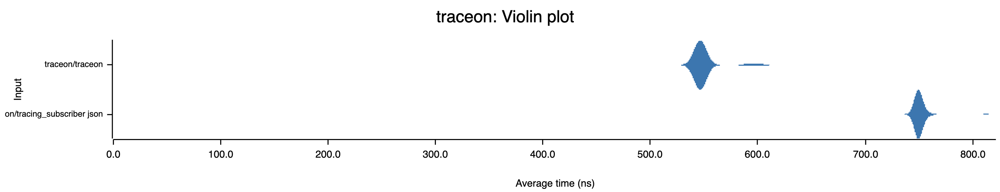
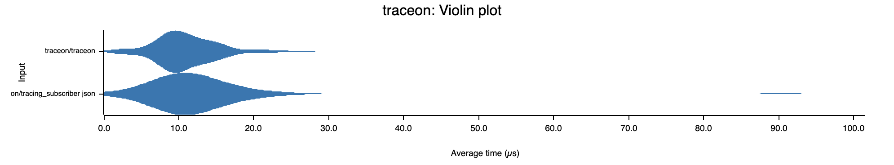
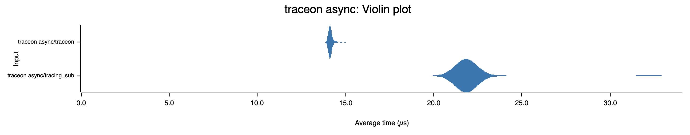

# Traceon - trace on json
An easy to use log and tracing formatter with a flattened json output, it only takes one line of code for good defaults, with an easy to use builder for configuration.

The main purpose of this crate is to simplify the concept of `tracing`, the only two crates you'll need in your `Cargo.toml` are:

```toml
[dependencies]
tracing = "0.1"
traceon = "0.1"
```
And you can write your first trace with:
```rust
fn main() {
    traceon::on();
    tracing::info!("a simple message");
}
```
Which will give the default output (which can be configured):
```json
{
  "message": "a simple message",
  "level": 30,
  "time": "2022-12-27T10:16:24.570889Z",
  "file": "src/main.rs:14"
}
```

Log levels are converted to numbers by default:
```text
trace: 10
debug: 20
info:  30
warn:  40
error: 50
```

By default `env-filter` is used at the `info` level, to change the level you can set an environment variable e.g. `RUST_LOG=warn`, all the options are [detailed here](https://docs.rs/env_logger/latest/env_logger/)

## Examples

### \#\[instrument\] macro
If you're using `async` functions, you can use the `tracing::instrument` macro to capture the arguments used in each function call:
```rust
#[tracing::instrument]
async fn add(a: i32, b: i32) {
    tracing::info!("result: {}", a + b);
}

#[tokio::main]
async fn main() {
    traceon::on();
    add(5, 10).await;
}
```

```json
{
  "message": "result: 15",
  "level": 30,
  "time": "2022-12-27T10:48:56.957671Z",
  "span": "add",
  "file": "src/main.rs:3",
  "a": 5,
  "b": 10
}
```

### Instrument trait
If you need to add additional context to an async function, you can create a span and instrument it:
```rust
use tracing::Instrument;

async fn add(a: i32, b: i32) {
    tracing::info!("result: {}", a + b);
}

#[tokio::main]
async fn main() {
    traceon::on();
    let span = tracing::info_span!("math functions", package_name = env!("CARGO_PKG_NAME"));
    add(5, 10).instrument(span).await;
}
```

```json
{
  "message": "result: 15",
  "level": 30,
  "time": "2022-12-27T11:11:25.540256Z",
  "span": "math functions",
  "file": "src/main.rs:4",
  "package_name": "testing_traceon"
}
```
The above `package_name` comes from the environment variable provided by cargo, which gets it from `Cargo.toml` at compile time and saves it for runtime:
```toml
[package]
name = "testing_traceon"
```

__IMPORTANT!__ if you're using async functions the above two methods should be used to create a span, [more details here](https://docs.rs/tracing/latest/tracing/struct.Span.html#in-asynchronous-code) 

### Nested spans
To combine the output from the two examples above we can enter a span with the arguments added to the trace:
```rust
use tracing::Instrument;

async fn add(a: i32, b: i32) {
    // Warning! Don't put any `.await` calls in between `entered()` and `exit()`
	// it will cause information loss and memory leaks
    let span = tracing::info_span!("add", a, b).entered();
    tracing::info!("result: {}", a + b);
    span.exit();
}

#[tokio::main]
async fn main() {
    traceon::on();
    let span = tracing::info_span!("math_functions", package_name = env!("CARGO_PKG_NAME"));
    add(5, 10).instrument(span).await;
}
```

```json
{
  "level": 30,
  "time": "2022-12-28T12:19:43.386923Z",
  "file": "examples/nested_spans.rs:6",
  "message": "result: 15",
  "span": "math_functions::add",
  "a": 5,
  "package_name": "traceon",
  "b": 10
}
```
You can see above that the child span name `add` was concatenated to the parent span name `math_functions` with the characters `::`, if you prefer the span just overrides the parent you can turn this functionality off:
```rust
fn main() {
	traceon::builder().concat("").on();
}
```
```json
{
  "level": 30,
  "time": "2022-12-28T12:19:43.386923Z",
  "file": "examples/nested_spans.rs:6",
  "message": "result: 15",
  "span": "add",
  "a": 5,
  "package_name": "traceon",
  "b": 10
}
```

or set it to something different:
```rust
fn main() {
	traceon::builder().concat(">").on();
}
```

```json
{
  "level": 30,
  "time": "2022-12-28T12:19:43.386923Z",
  "file": "examples/nested_spans.rs:6",
  "message": "result: 15",
  "span": "math_functions>add",
  "a": 5,
  "package_name": "traceon",
  "b": 10
}
```

The `add` function from above could be rewritten like this:

```rust
async fn add(a: i32, b: i32) {
    let _span = tracing::info_span!("add", a, b).entered();
    tracing::info!("result: {}", a + b);
}
```
This will cause the span to exit at the end of the function when _span is dropped, just remember to be very careful not to put any `.await` points when an `EnteredSpan` like `_span` above is being held.

### Turn off fields
This is an example of changing the defaults fields:

```rust
use traceon::LevelFormat;

mod helpers {
    pub fn trace() {
        tracing::info!("in helpers module");
    }
}

fn main() {
    traceon::builder()
        .module(true)
        .span(false)
        .file(false)
        .time(false)
        .level(LevelFormat::Off)
        .on();

    tracing::info!("only the module and message");
    helpers::trace();
}
```
```json
{
  "message": "only the module and message",
  "module": "bootstrap"
}
{
  "message": "in helpers module",
  "module": "bootstrap::helpers"
}
```
This was using a Cargo.toml with the binary renamed to `bootstrap` for demonstration purposes:

```toml
[[bin]]
name = "bootstrap"
path = "src/main.rs"
```

### Write to a file
If you wanted to write to log files instead of std, it's as simple adding the dependency to `Cargo.toml`:
```toml
[dependencies]
tracing-appender = "0.2.2"
```
And initializing it via the builder: 
```rust
fn main() {
    let file_appender = tracing_appender::rolling::hourly("./", "test.log");
    traceon::builder().writer(file_appender).on();
    tracing::info!("wow cool!");
}
```

### Compose with other layers
You can also use the formatting layer with other tracing layers as you get more comfortable with the tracing ecosystem, e.g. to change the filter:

```rust
use tracing_subscriber::{prelude::*, EnvFilter};

fn main() {
    tracing_subscriber::registry()
        .with(traceon::builder())
        .with(EnvFilter::new("error"))
        .init();

    tracing::info!("info log message won't write to stdout");
    tracing::error!("only error messages will write to stdout");
}
```

### Change the case of keys
Often you'll be consuming different crates that implement their own traces, and you need all keys to match a certain format:
```rust
use traceon::KeyCase;
fn main() {
    traceon::builder().key_case(KeyCase::Snake).on();
    let _span = tracing::info_span!("wow", BadCase = "change the key to snake case").entered();
    tracing::info!("make sure PascalCase changes to snake_case");
}
```
```json
{
  "level": 30,
  "timestamp": "2022-12-28T15:52:44.521437Z",
  "module": "casing",
  "file": "examples/casing.rs:4",
  "message": "make sure PascalCase changes to snake_case",
  "bad_case": "change the key to snake case"
}
```

## Pretty Printing Output
For pretty printing the output like the examples above, install [jq](https://stedolan.github.io/jq/download/) and run commands like:
```bash
cargo run | jq -R 'fromjson?'
```

## Performance
This crate uses the idea originated from: [LukeMathWalker/tracing-bunyan-formatter](https://github.com/LukeMathWalker/tracing-bunyan-formatter) of storing fields from visited spans in a `HashMap` instead of a `BTreeMap` which is more suited for flattening fields, and results in very similar performance to the json formatter in `tracing-subcriber`:

logging to a sink

units = nanosecond or billionth of a second

logging to stdout

units = microsecond or millionth of a second

And if we nest spans three levels deep, we get better overall performance even with concatenated fields:

